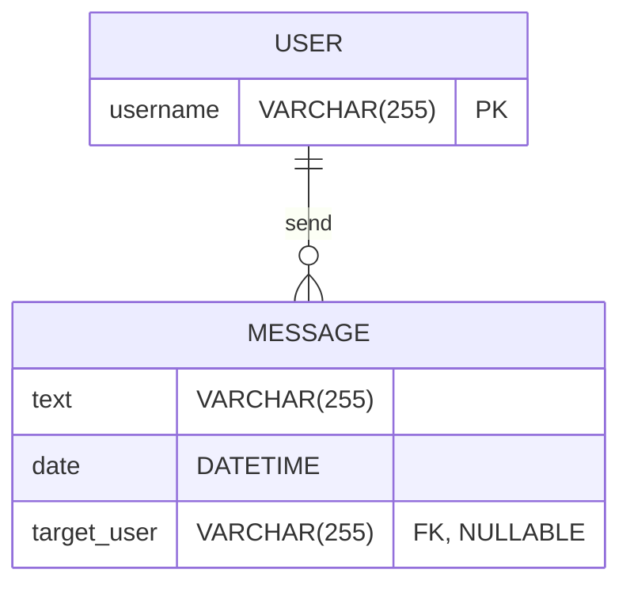

# `Mono<T>`

## Repository
https://github.com/Guybrush3791/boolean-uk-1-fortnox-webflux-mono.git

## Learning Objectives

- *Reactive* programming
- *WebFlux*
- `Mono<T>` class and it's use in *Reactive programming* context

## Instructions

1. Fork this repository
2. Clone your fork to your machine
3. Open the project in *IntelliJ*
4. Copy `application.yaml.example` to `application.yml` and fill out your *database* and *security* connection details
5. Check that `build.gradle` contains the correct dependencies and rerun gradle sync to make it all update

## Activity
### Core
You have a very simplified **messaging app** with following database

> [!note] Messages *without `target_user`* is intended to be *broadcast message*.  They must be supported on the <u>**[[#Extension]] part only**</u>

#### Feature
Provide *end-points* to support following capabilities for the system:
- **CRUD** on `User` table
- **SEND** new `Message` with or without the *target user*
- **LISTEN** for new `Message` per user

##### SEND `Message`
This *end-point* just create a new `Message` row into the relative table

##### LISTEN for `Message`
This *end-point* send all messages available relative to a single user, at the beginning of the communication and then stay on waiting state. When new `Message` is created, it will be sent to all the listening `Users`

### Extension
Add support for the *broadcast message notification*, so when `User` is listening for incoming messages, he/she will receive both messages sent to him/her and *all broadcast messages*